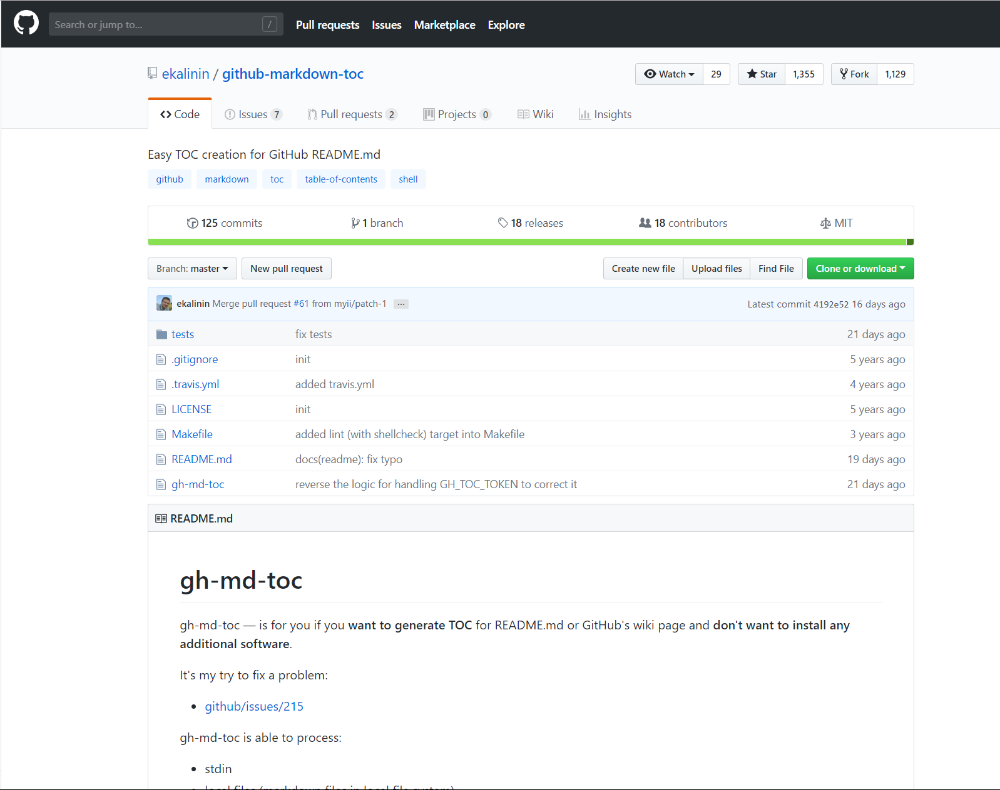
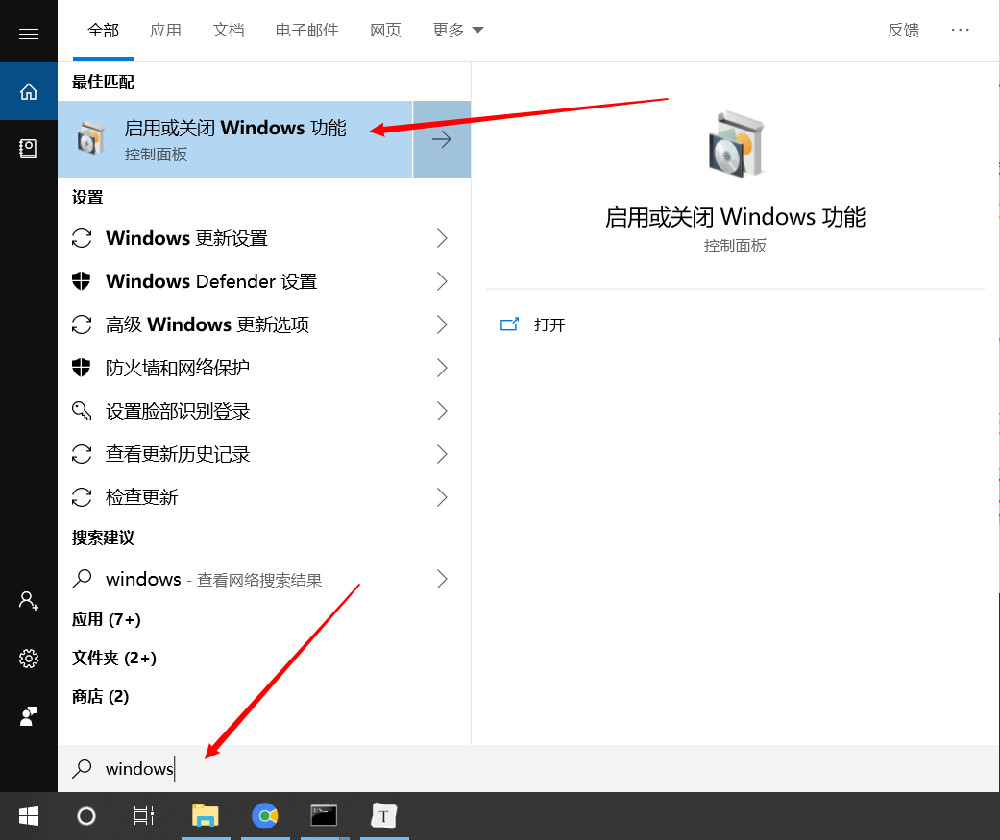
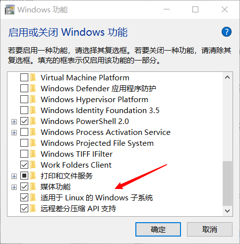
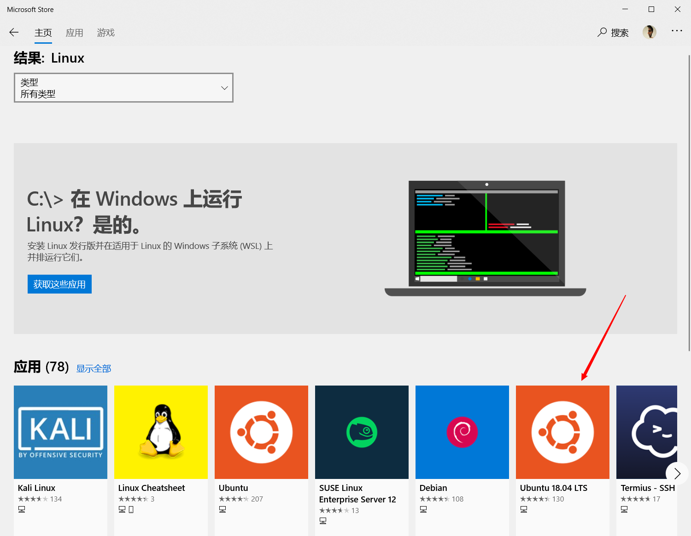
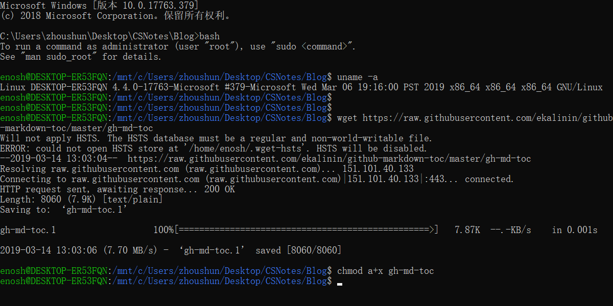
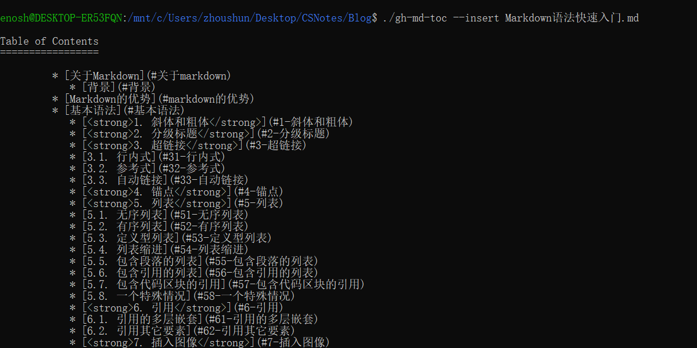

   * [背景](#背景)
   * [安装](#安装)
      * [（一）Linux子系统](#一linux子系统)
      * [（二）gh-md-toc](#二gh-md-toc)
   * [使用](#使用)
      * [（一）Local files](#一local-files)
      * [（二）Remote files](#二remote-files)
   * [参考](#参考)

## 背景

> 目录一直是github的一大缺失，每次在github写README.md 和Markdown博客时，内容较多时阅读不方便，也没有自动生成的 TOC(目录)。有需求，才有创作。

于是在github的仓库中找到一个热门项目: [github-markdown-toc](https://github.com/ekalinin/github-markdown-toc)



但是此项目只支持Linux 和 OSX，并为对Windows 适配。但目前使用的Win10 系统中内嵌了一个Ubantu 的子系统，于是乎想到在Win10 中使用Linux 子系统的方法解决此问题。


# 安装

## （一）Linux子系统

1. 打开 ”启动或关闭Windows功能"



2. 勾选 ”适用于Linux的Windows子系统"

   

   打开功能后需要重启系统。

3. 在Mircosoft Store 中搜索 “Linux"，选择安装自己喜欢的Linux发行版本

   

4. 安装完成后，在CMD 中键入 ”bash" 进入Linux子系统，并挂载到CMD的当前目录下

   

## （二）gh-md-toc

分别键入以下两条命令：

```
$ wget https://raw.githubusercontent.com/ekalinin/github-markdown-toc/master/gh-md-toc
$ chmod a+x gh-md-toc
```




# 使用

## （一）Local files

1. 键入命令 “ ./gh-md-toc --insert Markdown语法快速入门.md ”

   

2. 可以将终端中的内如粘贴复制到源文件中，也可以在文件目录下找到生成的目录文件

   

## （二）Remote files

1. 键入命令 “./gh-md-toc https://github.com/ekalinin/envirius/blob/master/README.md”

2. 同Local files


# 参考

[1] 项目地址：https://github.com/ekalinin/github-markdown-toc/blob/master/README.md